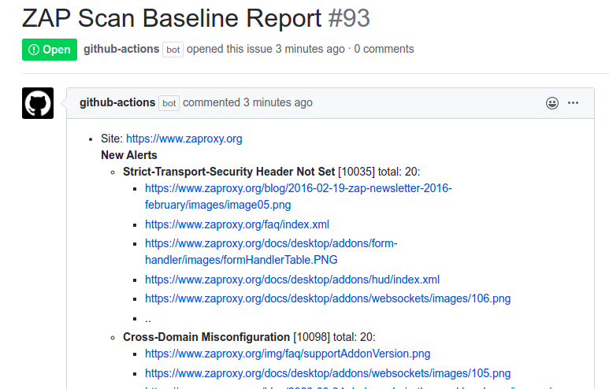
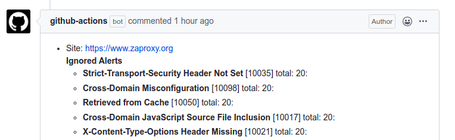
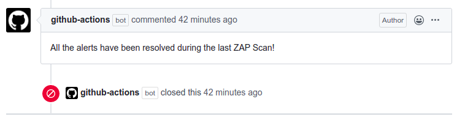

# Action Baseline

A GitHub Action for running the ZAP [Baseline scan](https://www.zaproxy.org/docs/docker/baseline-scan/) to find vulnerabilities in your web application. 
 
The ZAP baseline action scans a target URL for vulnerabilities and maintains an issue in GitHub repository for the
identified alerts. Read the following [blog post](https://www.zaproxy.org/blog/2020-04-09-automate-security-testing-with-zap-and-github-actions) 
for additional information.

## Inputs

### `target`

**Required** The URL of the web application to be scanned. This can be either a publicly available web application or a locally
accessible URL.

### `docker_name`

**Optional** The name of the docker file to be executed. By default the action runs the stable version of ZAP. But you can 
configure the parameter to use the weekly builds.

### `rules_file_name`

**Optional** You can also specify a relative path to the rules file to ignore any alerts from the ZAP scan. Make sure to create
the rules file inside the relevant repository. The following shows a sample rules file configuration.
Make sure to checkout the repository (actions/checkout@v2) to provide the ZAP rules to the scan action.

```tsv
10011	IGNORE	(Cookie Without Secure Flag)
10015	IGNORE	(Incomplete or No Cache-control and Pragma HTTP Header Set)
``` 

### `cmd_options`

**Optional** Additional command lines options for the baseline script

### `allow_issue_writing`

**Optional** By default the baseline action will file the report to the GitHub issue using the `issue_title` input.
Set this to false if you don't want the issue to be created or updated.

### `issue_title`

**Optional** The title for the GitHub issue to be created

### `token`

**Optional** ZAP action uses the default action token provided by GitHub to create and update the issue for the baseline scan.
You do not have to create a dedicated token. Make sure to use the GitHub's default action token when running the action(`secrets.GITHUB_TOKEN`).

### `fail_action`

**Optional** By default ZAP Docker container will fail with an [exit code](https://github.com/zaproxy/zaproxy/blob/efb404d38280dc9ecf8f88c9b0c658385861bdcf/docker/zap-baseline.py#L31), 
if it identifies any alerts. Set this option to `true` if you want to fail the status of the GitHub Scan if ZAP identifies any alerts during the scan.  

### `artifact_name`

**Optional** By default the baseline action will attach the report to the build with the name `zap_scan`. Set this to a different string to name it something else. Consult [GitHub's documentation](https://github.com/actions/toolkit/blob/main/packages/artifact/docs/additional-information.md#non-supported-characters) for which artifact names are allowed.

## Example usage

** Basic **
```
steps:
  - name: ZAP Scan
    uses: zaproxy/action-baseline@v0.9.0
    with:
      target: 'https://www.zaproxy.org'
```

** Advanced **

```
on: [push]

jobs:
  zap_scan:
    runs-on: ubuntu-latest
    name: Scan the webapplication
    steps:
      - name: Checkout
        uses: actions/checkout@v2
        with:
          ref: master
      - name: ZAP Scan
        uses: zaproxy/action-baseline@v0.9.0
        with:
          token: ${{ secrets.GITHUB_TOKEN }}
          docker_name: 'ghcr.io/zaproxy/zaproxy:stable'
          target: 'https://www.zaproxy.org'
          rules_file_name: '.zap/rules.tsv'
          cmd_options: '-a'
```

## Issue Description

The following [issue](https://github.com/zaproxy/zaproxy-website/issues/93) shows how the GitHub Baseline Action scans the 
[https://www.zaproxy.org/](https://www.zaproxy.org/) website and notifies the users via opening an issue in the ZAP website repository. 
The issue will be created by the GitHub Actions bot and will list the alerts as issue comments.

[](https://github.com/zaproxy/zaproxy-website/issues/93#issue-597219582)

To demonstrate the workflow of the action; we are ignoring the alerts as they are not relevant, but this has the same effect as fixing them.
Therefore during the second scan we are ignoring few alerts via ZAP rules and the action bot updates the issue with the newly ignored/resolved alerts. 
[](https://github.com/zaproxy/zaproxy-website/issues/93#issuecomment-611490632)


During the last scan we are ignoring all the alerts, thus resulting in finding zero alerts. Based on the scan results 
the actions bot will close the ongoing open issue.
[](https://github.com/zaproxy/zaproxy-website/issues/93#issuecomment-611496321)

## Localised Alert Details

ZAP is internationalised and alert information is available in many languages.

You can change the language used by this action by changing the locale via the `cmd_options` e.g.: `-z "-config view.locale=fr_FR"`

See [https://github.com/zaproxy/zaproxy/tree/main/zap/src/main/dist/lang](https://github.com/zaproxy/zaproxy/tree/main/zap/src/main/dist/lang) for the full set of locales currently supported.

You can help improve ZAP translations via [https://crowdin.com/project/zaproxy](https://crowdin.com/project/zaproxy). 
