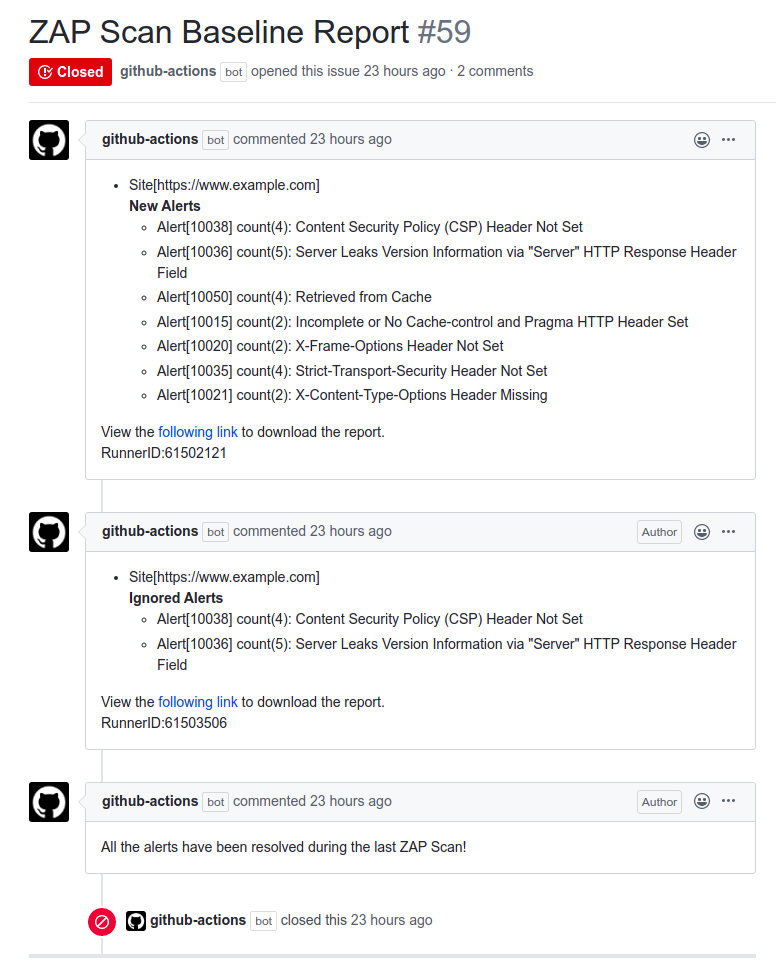

# Action Baseline

A GitHub Action for running the OWASP ZAP [Baseline scan](https://github.com/zaproxy/zaproxy/wiki/ZAP-Baseline-Scan). 

The ZAP baseline action scans a target URL for vulnerabilities and maintains an issue in GitHub repository for the
identified alerts.


## Inputs

### `Github token`

**Required** ZAP action uses the default action token provided by GitHub to create and update the issue for the baseline scan.

### `target`

**Required** The URL of the web application to be scanned. This can be either a publicly available web application or a locally
accessible URL.

### `docker_name`

**Optional** The name of the docker file to be executed. By default the action runs the stable version of ZAP. But you can 
configure the parameter to use the weekly builds.

### `rules_file_name`

**Optional** You can also specify a relative path to the rules file to ignore any alerts from the ZAP scan. Make sure to create
the rules file inside the relevant repository. The following shows a sample rules file configuration.

```tsv
10011	IGNORE	(Cookie Without Secure Flag)
10015	IGNORE	(Incomplete or No Cache-control and Pragma HTTP Header Set)
``` 

## Example usage

** Basic **
```
steps:
  - name: ZAP Scan
    uses: zaproxy/action-baseline
    with:
      token: ${{ secrets.GIT_TOKEN }}
      target: 'https://www.zaproxy.org/'
```

** Advanced **

```
on: [push]

jobs:
  zap_scan:
    runs-on: ubuntu-latest
    name: Scan the webapplication
    steps:
      - name: Checkout
        uses: actions/checkout@v2
        with:
          ref: master
      - name: ZAP Scan
        uses: zaproxy/action-baseline
        with:
          token: ${{ secrets.GITHUB_TOKEN }}
          docker_name: 'owasp/zap2docker-stable'
          target: 'https://www.example.com'
          rules_file_name: '.zap/rules.tsv'
```

## Additional Information

The following image shows how the alerts will be updated for consequent scan.

- First Comment: A fresh ZAP scan creates a new issue with links to the report.
- Second Comment: During the second scan we have ignored two alerts via the rule configurations. Therefore, ZAP ignores the two alerts and reports as the two alerts have been resolved.
- Third Comment: During the third scan we are ignoring all the alerts. If all the alerts have been resolved, then the action will automatically close the pending issue. 



